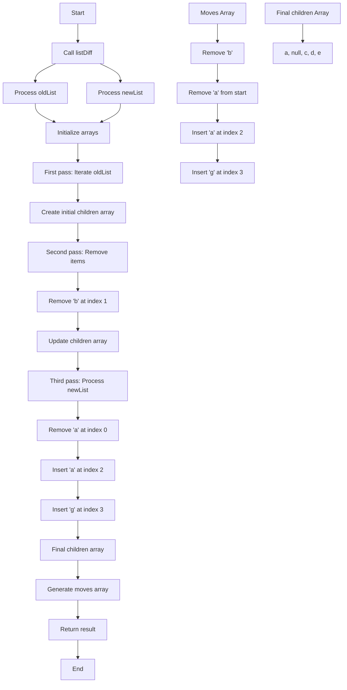

```mermaid
graph TD
    A[Start] --> B[Call listDiff]
    B --> C[Process oldList]
    B --> D[Process newList]
    C --> E[Initialize arrays]
    D --> E
    E --> F[First pass: Iterate oldList]
    F --> G[Create initial children array]
    G --> H[Second pass: Remove items]
    H --> I[Remove 'b' at index 1]
    I --> J[Update children array]
    J --> K[Third pass: Process newList]
    K --> L[Remove 'a' at index 0]
    L --> M[Insert 'a' at index 2]
    M --> N[Insert 'g' at index 3]
    N --> O[Final children array]
    O --> P[Generate moves array]
    P --> Q[Return result]
    Q --> R[End]

    S[Moves Array] --> T[Remove 'b']
    T --> U[Remove 'a' from start]
    U --> V[Insert 'a' at index 2]
    V --> W[Insert 'g' at index 3]

    X[Final children Array] --> Y[a, null, c, d, e]
```