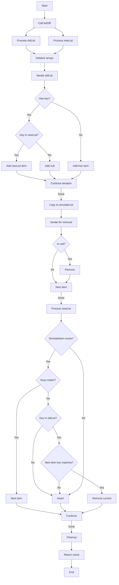

```mermaid
graph TD
    A[Start] --> B[Call listDiff]
    B --> C[Process oldList]
    B --> D[Process newList]
    C --> E[Initialize arrays]
    D --> E
    E --> F[Iterate oldList]
    F --> G{Has key?}
    G -->|Yes| H{Key in newList?}
    H -->|Yes| I[Add newList item]
    H -->|No| J[Add null]
    G -->|No| K[Add free item]
    I --> L[Continue iteration]
    J --> L
    K --> L
    L -->|Done| M[Copy to simulateList]
    M --> N[Iterate for removal]
    N --> O{Is null?}
    O -->|Yes| P[Remove]
    O -->|No| Q[Next item]
    P --> Q
    Q -->|Done| R[Process newList]
    R --> S{SimulateItem exists?}
    S -->|Yes| T{Keys match?}
    T -->|Yes| U[Next item]
    T -->|No| V{Key in oldList?}
    V -->|No| W[Insert]
    V -->|Yes| X{Next item key matches?}
    X -->|Yes| Y[Remove current]
    X -->|No| W
    S -->|No| W
    U --> Z[Continue]
    W --> Z
    Y --> Z
    Z -->|Done| AA[Cleanup]
    AA --> AB[Return result]
    AB --> AC[End]
```